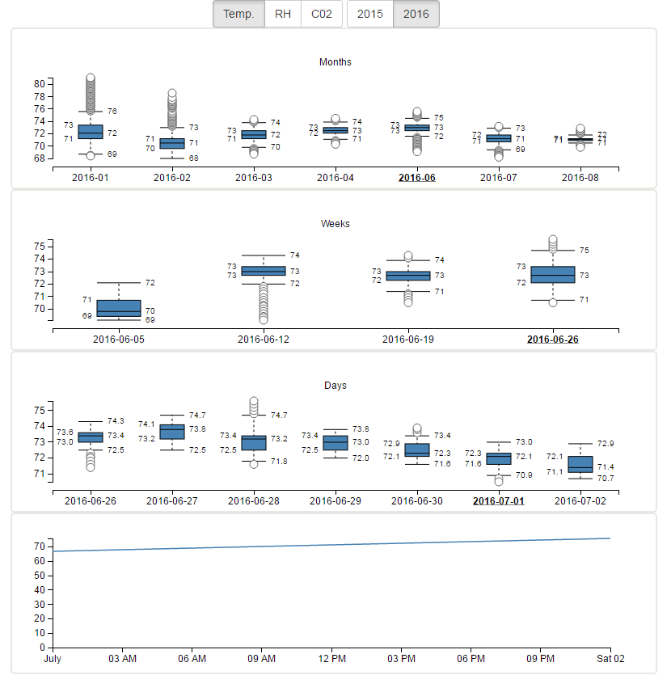

# React-d3-boxplot

This example builds off colors example. It adds a higher order reducer to intercept stat values to format the value to create layered boxplots ( see format below ). Basically, the reducer groups the items hierarchically so the outer most objects are months which contain weeks which contains days.  It also computes the range for all the datapoints within each group. Clicking on the each boxplot item drills down into the set of box plots.

## Screenshot


```` javascript
dataIn =
{
    "daily": [
                {
                    "relativeHumidity": {
                        "median": 41.6,
                        "q1": 41.3,
                        "q3": 41.8,
                        "max": 42.5,
                        "min": 40.8,
                        "outliers": [
                        ]
                    },
                    "date": "2015-11-03",
                    "cO2Level": {
                        "median": 424,
                        "q1": 413,
                        "q3": 433,
                        "max": 455,
                        "min": 401,
                        "outliers": [
                        ]
                    },
                    "temperatureF": {
                        "median": 71.8,
                        "q1": 71.8,
                        "q3": 72,
                        "max": 72.1,
                        "min": 71.4,
                        "outliers": [
                        ]
                    }
                },
                {
                    "relativeHumidity": {
                        "median": 41.3,
                        "q1": 41.1,
                        "q3": 41.6,
                        "max": 42.3,
                        "min": 40.5,
                        "outliers": [
                        ]
                    },
                    "date": "2015-12-03",
                    "cO2Level": {
                        "median": 422,
                        "q1": 409,
                        "q3": 448,
                        "max": 482,
                        "min": 401,
                        "outliers": [
                        ]
                    },
                    "temperatureF": {
                        "median": 72.3,
                        "q1": 72,
                        "q3": 72.3,
                        "max": 72.7,
                        "min": 71.6,
                        "outliers": [
                        ]
                    }
                }
            ],
    "weekly": [
                {
                    "relativeHumidity": {
                        "median": 38.7,
                        "q1": 23.5,
                        "q3": 42.9,
                        "max": 52,
                        "min": 20.2,
                        "outliers": []
                    },
                    "date": "2016-11-02",
                    "cO2Level": {
                        "median": 425,
                        "q1": 419,
                        "q3": 436,
                        "max": 451,
                        "min": 406,
                        "outliers": [
                        ]
                    },
                    "temperatureF": {
                        "median": 72.1,
                        "q1": 71.6,
                        "q3": 72.5,
                        "max": 73.6,
                        "min": 70.7,
                        "outliers": [
                            73.8
                        ]
                    }
                },
                {
                    "relativeHumidity": {
                        "median": 22.2,
                        "q1": 21.8,
                        "q3": 30,
                        "max": 31.8,
                        "min": 21.3,
                        "outliers": []
                    },
                    "date": "2015-12-02",
                    "cO2Level": {
                        "median": 420,
                        "q1": 415,
                        "q3": 426,
                        "max": 437,
                        "min": 403,
                        "outliers": [
                        ]
                    },
                    "temperatureF": {
                        "median": 71.8,
                        "q1": 71.6,
                        "q3": 72.9,
                        "max": 73.4,
                        "min": 70.9,
                        "outliers": []
                    }
                },
                {
                    "relativeHumidity": {
                        "median": 22.2,
                        "q1": 21.8,
                        "q3": 30,
                        "max": 31.8,
                        "min": 21.3,
                        "outliers": []
                    },
                    "date": "2016-01-01",
                    "cO2Level": {
                        "median": 420,
                        "q1": 415,
                        "q3": 426,
                        "max": 437,
                        "min": 403,
                        "outliers": [
                        ]
                    },
                    "temperatureF": {
                        "median": 71.8,
                        "q1": 71.6,
                        "q3": 72.9,
                        "max": 73.4,
                        "min": 70.9,
                        "outliers": []
                    }
                }
            ],
    "monthly": [
                {
                    "relativeHumidity": {
                        "median": 21.8,
                        "q1": 18.7,
                        "q3": 32,
                        "max": 41.8,
                        "min": 13.2,
                        "outliers": [
                        ]
                    },
                    "date": "2015-11-01",
                    "cO2Level": {
                        "median": 424,
                        "q1": 417,
                        "q3": 432,
                        "max": 447,
                        "min": 401,
                        "outliers": [
                        ]
                    },
                    "temperatureF": {
                        "median": 71.2,
                        "q1": 70.5,
                        "q3": 71.6,
                        "max": 72.9,
                        "min": 69.4,
                        "outliers": [
                        ]
                    }
                },
                {
                    "relativeHumidity": {
                        "median": 43.1,
                        "q1": 42.5,
                        "q3": 43.5,
                        "max": 44.7,
                        "min": 41.5,
                        "outliers": [
                        ]
                    },
                    "date": "2016-01-01",
                    "cO2Level": {
                        "median": 439,
                        "q1": 428,
                        "q3": 458,
                        "max": 485,
                        "min": 395,
                        "outliers": [
                        ]
                    },
                    "temperatureF": {
                        "median": 71.1,
                        "q1": 70.9,
                        "q3": 71.2,
                        "max": 71.8,
                        "min": 70.5,
                        "outliers": [
                        ]
                    }
                },
                  {
                    "relativeHumidity": {
                        "median": 31.1,
                        "q1": 24.3,
                        "q3": 39.3,
                        "max": 53.6,
                        "min": 18.1,
                        "outliers": [
                        ]
                    },
                    "date": "2015-12-01",
                    "cO2Level": {
                        "median": 412,
                        "q1": 402,
                        "q3": 425,
                        "max": 447,
                        "min": 382,
                        "outliers": [
                        ]
                    },
                    "temperatureF": {
                        "median": 71.4,
                        "q1": 70.9,
                        "q3": 72.3,
                        "max": 73.8,
                        "min": 69.8,
                        "outliers": [
                        ]
                    }
                }
            ]
}
````


````javascript
dataOut =
{
    "stats": {
        "range": {
            "relativeHumidity": {
                "min": 13.2,
                "max": 53.6
            },
            "cO2Level": {
                "min": 382,
                "max": 485
            },
            "temperatureF": {
                "min": 69.4,
                "max": 73.8
            }
        },
        "2015-11-01": {
            "relativeHumidity": {
                "median": 21.8,
                "q1": 18.7,
                "q3": 32,
                "max": 41.8,
                "min": 13.2,
                "outliers": []
            },
            "date": "2015-11-01",
            "cO2Level": {
                "median": 424,
                "q1": 417,
                "q3": 432,
                "max": 447,
                "min": 401,
                "outliers": []
            },
            "temperatureF": {
                "median": 71.2,
                "q1": 70.5,
                "q3": 71.6,
                "max": 72.9,
                "min": 69.4,
                "outliers": []
            },
            "range": {},
            "children": {}
        },
        "2016-01-01": {
            "relativeHumidity": {
                "median": 43.1,
                "q1": 42.5,
                "q3": 43.5,
                "max": 44.7,
                "min": 41.5,
                "outliers": []
            },
            "date": "2016-01-01",
            "cO2Level": {
                "median": 439,
                "q1": 428,
                "q3": 458,
                "max": 485,
                "min": 395,
                "outliers": []
            },
            "temperatureF": {
                "median": 71.1,
                "q1": 70.9,
                "q3": 71.2,
                "max": 71.8,
                "min": 70.5,
                "outliers": []
            },
            "range": {
                "relativeHumidity": {
                    "min": 21.3,
                    "max": 31.8
                },
                "cO2Level": {
                    "min": 403,
                    "max": 437
                },
                "temperatureF": {
                    "min": 70.9,
                    "max": 73.4
                }
            },
            "children": {
                "2016-01-01": {
                    "relativeHumidity": {
                        "median": 22.2,
                        "q1": 21.8,
                        "q3": 30,
                        "max": 31.8,
                        "min": 21.3,
                        "outliers": []
                    },
                    "date": "2016-01-01",
                    "cO2Level": {
                        "median": 420,
                        "q1": 415,
                        "q3": 426,
                        "max": 437,
                        "min": 403,
                        "outliers": []
                    },
                    "temperatureF": {
                        "median": 71.8,
                        "q1": 71.6,
                        "q3": 72.9,
                        "max": 73.4,
                        "min": 70.9,
                        "outliers": []
                    },
                    "range": {},
                    "children": {}
                }
            }
        },
        "2015-12-01": {
            "relativeHumidity": {
                "median": 31.1,
                "q1": 24.3,
                "q3": 39.3,
                "max": 53.6,
                "min": 18.1,
                "outliers": []
            },
            "date": "2015-12-01",
            "cO2Level": {
                "median": 412,
                "q1": 402,
                "q3": 425,
                "max": 447,
                "min": 382,
                "outliers": []
            },
            "temperatureF": {
                "median": 71.4,
                "q1": 70.9,
                "q3": 72.3,
                "max": 73.8,
                "min": 69.8,
                "outliers": []
            },
            "range": {
                "relativeHumidity": {
                    "min": 21.3,
                    "max": 31.8
                },
                "cO2Level": {
                    "min": 403,
                    "max": 437
                },
                "temperatureF": {
                    "min": 70.9,
                    "max": 73.4
                }
            },
            "children": {
                "2015-12-02": {
                    "relativeHumidity": {
                        "median": 22.2,
                        "q1": 21.8,
                        "q3": 30,
                        "max": 31.8,
                        "min": 21.3,
                        "outliers": []
                    },
                    "date": "2015-12-02",
                    "cO2Level": {
                        "median": 420,
                        "q1": 415,
                        "q3": 426,
                        "max": 437,
                        "min": 403,
                        "outliers": []
                    },
                    "temperatureF": {
                        "median": 71.8,
                        "q1": 71.6,
                        "q3": 72.9,
                        "max": 73.4,
                        "min": 70.9,
                        "outliers": []
                    },
                    "range": {
                        "relativeHumidity": {
                            "min": 40.5,
                            "max": 42.3
                        },
                        "cO2Level": {
                            "min": 401,
                            "max": 482
                        },
                        "temperatureF": {
                            "min": 71.6,
                            "max": 72.7
                        }
                    },
                    "children": {
                        "2015-12-03": {
                            "relativeHumidity": {
                                "median": 41.3,
                                "q1": 41.1,
                                "q3": 41.6,
                                "max": 42.3,
                                "min": 40.5,
                                "outliers": []
                            },
                            "date": "2015-12-03",
                            "cO2Level": {
                                "median": 422,
                                "q1": 409,
                                "q3": 448,
                                "max": 482,
                                "min": 401,
                                "outliers": []
                            },
                            "temperatureF": {
                                "median": 72.3,
                                "q1": 72,
                                "q3": 72.3,
                                "max": 72.7,
                                "min": 71.6,
                                "outliers": []
                            }
                        }
                    }
                }
            }
        }
    }
}
````

## Instructions

This is a client server app. Open two terminals and run npm install in the client and server
directories.

To run the server app run npm start from the server directory, this will create a socket io server on port 8090 used for state notifications to the client

For hot loading run webpack-dev-server --host 0.0.0.0 from the client directory

Connect a browser to <YOUR_IP>:8080

Updates to the any of the client files should hot load.

